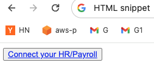

<p align="center">
  <a href="https://affixapi.com">
    
  </a>
</p>

## Starter kit resources

- [Connect guide](./connect): examples on how to use Connect
- [Typescript SDK usage example](./sdk-example): examples on how to use the [Typescript SDK](https://www.npmjs.com/package/@affixapi/api)
- [curl collection](./curl-collection): example scripts calling the api with `curl`
- [jest mocks](./jest-mocks): example jest mocks to test specific scenarios of `affixapi` responses

## Read our documentation

- [API Reference](https://docs.affixapi.com/)

## SDKs

### Backend
- [Typescript](https://www.npmjs.com/package/@affixapi/api-no-joi)
- [Typescript with Joi runtime validations](https://www.npmjs.com/package/@affixapi/api-with-joi)
- [Go](https://pkg.go.dev/github.com/affixapi/go-sdk)
- [Java](https://central.sonatype.com/artifact/com.affixapi/api)
- [Python](https://pypi.org/p/affixapi/)
- [Ruby](https://rubygems.org/gems/affixapi)
- [C# + .NET](https://www.nuget.org/packages/AffixApi.Api)
- [PHP](https://packagist.org/packages/affixapi/api)

### Frontend
- [React](https://www.npmjs.com/package/@affixapi/connect-sdk)
- [HTML](https://github.com/affixapi/starter-kit?tab=readme-ov-file#html-snippet)

### HTML snippet

```html
<html>
  <button type="button">
    <a target="popup" href='https://dev.connect.affixapi.com/?client_id=[YOUR CLIENT ID]&mode=xhr&scope=/2023-03-01/xhr/company%20/2023-03-01/xhr/identity%20/2023-03-01/xhr/employee%20/2023-03-01/xhr/employees%20/2023-03-01/xhr/timesheets%20/2023-03-01/xhr/time-off-entries%20/2023-03-01/xhr/time-off-balances%20/2023-03-01/xhr/payruns%20/2023-03-01/xhr/payruns/:payrun_id%20/2023-03-01/xhr/work-locations%20/2023-03-01/xhr/groups%20&redirect_uri=https://affixapi.com'>
      Connect your HR/Payroll
    </a>
  </button>
</html>
```

=>

<a href="https://affixapi.com">
  
</a>

## Launch

With your `client_id` key, you are ready to start the authenticate flow with
live users. Using [Connect](./connect) successfully will generate an
`authorzation_code`, which you can then use the [curl
scripts](./curl-collection) to obtain an `access_token`. With the
`access_token`, you are now ready to call the affixapi API.

In all API calls to you must include the API key in the `Authorization` header:
`"Authorization" : "Bearer <Access_Token>"`.

## Get in touch
- [Send us a message](mailto:hello@affixapi.com) to talk to our development team
- [Create an issue](https://github.com/affixapi/starter-kit/issues) in this repo if you encounter a bug
