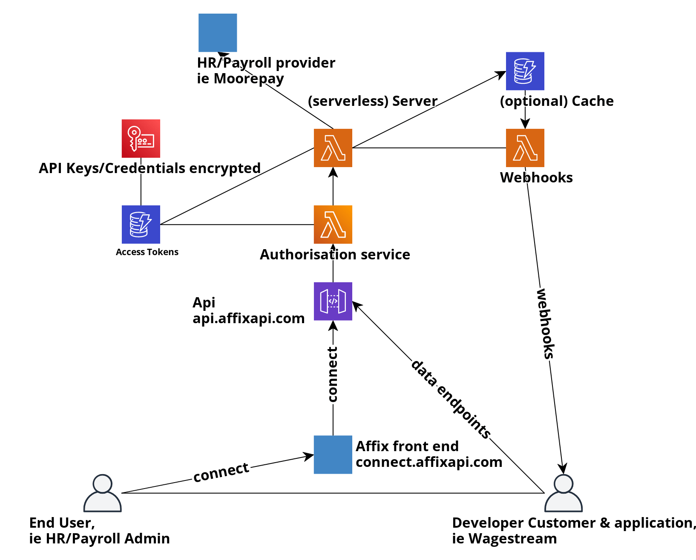
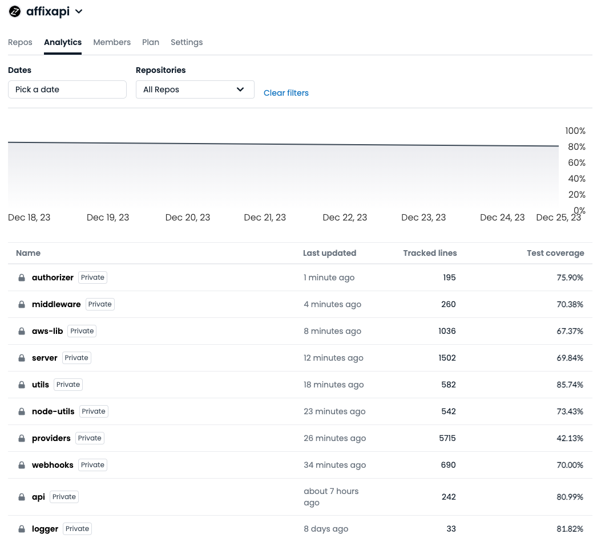

# Security

Affix API takes data security and privacy seriously. This page provides general
information about our data practices to give you confidence in how we secure
your data.

## Architecture

  

## Data center security

- The Affix API service infrastructure is hosted on Amazon Web Services (AWS)
- The Affix API connect front-end application is hosted on Github Pages, the dev
front-end application is hosted on Cloudflare Pages
- We follow AWS best practices which allows us to take advantage from their
  secured, distributed, fault tolerant environment. To find out more
  information about AWS security practices, see:
  <https://aws.amazon.com/security>

## Failover and disaster recovery

- Our infrastructure and systems use only serverless AWS services, which provide
high availability. Example of serverless services used in the Affix API
architecture: AWS API Gateway, AWS Lambda, AWS DynamoDB.
- AWS itself will manage availability within regions for its serverless
  services
- All of the application service infrastructure, as well as the underlying AWS
  infrastructure, is codified. In the highly unlikely event that an AWS region
  is down, a redeployment to a different region is a simple task, due to all of
  the infrastructure being codified

## Data storage + retention policies

- We view data as a liability
- Our sole intention is to act as the glue between the developer and the
  provider
- We store as little data as possible, and only enough to satisfy the
  developer’s api requests with as little latency as possible. We have no
  interest in the content of the data
- We do not sell user data. We only share user data with a single party, the
  developer, and only user data that the user has explicitly authorized us to
  share
- We store cookies and/or API keys/credentials for valid access tokens; but we
  store them securely, and we store them because that is how we provide access
  to providers
- API keys /credentials are captured, encrypted via an AWS KMS symetric key
  with key rotation enabled, and stored (ciphertext only) in an AWS DynamoDB
  table (encrypted at rest). The reason we store username and passwords is to
  increase our service quality; without it, a token would only last two weeks.
  When storing, we can use it to refresh the cookies, and thus have a token
  that lasts years
- Our database, AWS DynamoDB, is secured via AWS IAM, and internal systems are
  provided access via the principal of least privilege.  Our encryption key, a
  Customer Managed Key behind AWS KMS, is secured via AWS IAM, and internal
  systems are provided access via the principal of least privilege
- Our systems use AWS Cloudwatch for logging. Our log retention policy is two
  weeks
- Client request and client responses are logged, but API keys/credentials and
  JWT signatures are redacted from the logs
- To debug errors that may occur with user configurations we may not have seen
  before, we may programmatically screenshot errors on a customer account while
  attempting to fulfill your API request. The screenshots are only generated
  when an unexpected error occurred, and are only used for debugging said
  error, and are used for no other purpose. The retention policy on those
  screenshots is five days. The S3 bucket that temporarily holds this data is
  encrypted at rest, is not public, and additionally has public access block
  enabled
- When a developer calls our /disconnect endpoint, your cookies, username, and
  password are wiped permanently from our system

## Encryption

- Traffic between you or customers and the Affix API application is encrypted
  in-transit with TLS
- The database (AWS Dynamo) and related cache stores are encrypted at rest
- API keys / credentials are stored at a hightened level of encryption: they
  are stored as ciphertext only, encrypted via an AWS KMS Customer Managed Key
  with key rotation enabled

## Source code

- Application infrastructure is codified via aws-cdk, and AWS infrastructure is
  codified via org-formation, and all changes to infrastructure or application
  source code are done via git
- Test coverage for all Affix API source code repositories is 85% as of May
  2023
- Dependencies are kept up to date automatically with Github Dependabot.
- If dependabot detects a vulnerable dependency version via the CVE database
  with a corresponding library fix, it will automatically resolve the
  vulnerable version without Affix API intervention
- Access to source code is secured with two-factor authentication

## Caching

- We cache aggressively to reduce latencies, but our retention policies on
  cached data is always less than two weeks
- The caches are stored as either AWS DynamoDB tables or as files on AWS S3
  depending on cache item size, but either method will store the data encrypted
  at rest

## Internal IT security

- Access to AWS infrastructure, source code, are secured with two-factor
  authentication
- Access to third party systems utilize two-factor authentication whenever
  possible
- Employees are given the lowest level of access that allows them to get their
  work done, and employee contracts include a confidentiality agreement
- Only authorized employees would have access to our software version control

## Third party systems

- We use Sentry for error alerting. Any sensitive payloads sent to Sentry are
  removed of their sensitive or identifiable values before sentry.
  Additionally, we have Sentry’s “data scrubbing” feature enabled, which scans
  and deletes any sensitive data that may have been sent, as well as removes ip
  addresses detected.
- We occasionally use browserless.io and brightdata.com for proxies &
  residential IP addresses to bypass bot-checks from providers browserless.io’s
  privacy policy: <https://www.browserless.io/privacy-policy/> brightdata.com’s
  privacy policy: <https://brightdata.com/privacy>

## Payments

- When you purchase a paid Affix API client_id, your payment data is not
  transmitted through nor stored on Affix API systems.
- When you purchase a client_id via Gumroad, your payment is processed using
  PCI Compliant service providers (as of May 2023, are PayPal Connect, Apple
  Pay, or Google Pay). Per Gumroad, your payment details are not stored on nor
  transmitted via Gumroad’s systems. to find out more about Gumroad’s security
  information, see:
  https://customers.gumroad.com/article/189-safe-gumroad-buying
- When purchasing a client_id, you are purchasing a subscription, and are
  charged monthly
- Your email address that you used for the purchase of the client_id is shared
  with Affix API, to initially set your client name, which we encourage you to
  email us after purchase to set your preferred application name, which is
  shown to your customers via Connect.
- You may cancel your Affix API and Gumroad subscription at any time by using
  the link sent to the email address you registered with.
- When you are invoiced monthly based on your token usage, we invoice you via
  Stripe and you are able to pay your invoice via Stripe. Stripe is certified
  to PCI Service Provider Level 1. To find more about Stripe's security
  information, see: https://stripe.com/help/security.

## Responsible disclosure

- If you have discovered a vulnerability in the Affix API application or
  services, please contact us at john[at]affixapi.com
- We review all security concerns brought to our attention, and we take a
  proactive approach to emerging security issues

## Contact us

If you have any questions, please contact us at john[at]affixapi.com

## Unit test coverage

  

